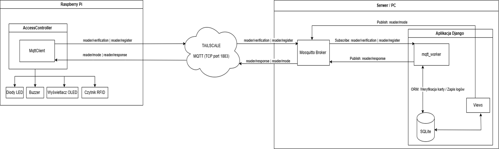

# RFID Access Control System (IoT)

An IoT-based access control system built with **Raspberry Pi** and **Django**, utilizing **MQTT** communication in a distributed architecture. The project enables real-time permission verification, remote card management, and secure communication via a VPN tunnel (Tailscale).

## Project Overview

The goal of this project is to create a complete "End-to-End" physical access control system. It consists of two main modules:
1.  **Edge Device:** Raspberry Pi equipped with an RFID reader and user interface (OLED, LED, Buzzer).
2.  **Central Server:** A Django application managing the user database, access logs, and business logic.

Communication between devices is handled asynchronously via the **MQTT** protocol. Thanks to **Tailscale**, the system operates securely independently of local network firewalls and NAT configurations.

## Architecture

The system operates on a Client-Server model:
* **Raspberry Pi** (Client) publishes card UIDs and listens for server decisions.
* **Server PC** (Host) processes requests using a background MQTT worker and saves data to an SQLite database.


### Tech Stack:
* **Hardware:** Raspberry Pi 4
* **Backend:** Python 3, Django
* **Communication:** MQTT (Eclipse Mosquitto)
* **Network:** Tailscale (VPN)
* **Database:** SQLite

## Features

The system offers two main operating modes, remotely switchable from the admin panel:

### 1. Validation Mode (Default)
* Real-time card validity verification.
* **Access Granted:** Visual (Green LED, OLED) and audio (Single beep) feedback.
* **Access Denied:** Visual (Red LED, OLED) and audio (Alarm sequence) feedback for unknown, blocked, or expired cards.

### 2. Registration Mode
* Enables adding new cards to the system simply by tapping them against the reader.
* Automatically extends the validity of existing cards.

### Web Dashboard (Django)
* Live access logs view (AJAX updates).
* User and Card management (CRUD).
* Card blocking/unblocking and validity extension.
* Remote device mode switching via MQTT.

## Hardware Layer

The Raspberry Pi controls the following peripherals using the `AccessController` class:
* **RFID Reader (RC522):** Reads card UIDs (SPI interface).
* **OLED Display:** Displays status messages and operating modes.
* **LED Strip (WS2812):** Provides visual feedback via specific color patterns.
* **Buzzer:** Generates audio signals.

All hardware operations (reading, animations, sound) run in separate threads to prevent blocking the main program loop.

## Installation & Setup

### Prerequisites
* Python 3.8+
* Mosquitto MQTT Broker
* Tailscale account (for remote connection)

### 1. Server Setup (PC)
```bash
# Install dependencies
pip install -r requirements.txt

# Run Mosquitto broker (if not running as a service)
mosquitto -c mosquitto.conf

# Run the MQTT worker (in a separate terminal)
python manage.py mqtt_worker

# Run the Django server
python manage.py runserver
```
### 2. Client Setup
```bash
# Install hardware dependencies and run the access controller
sudo python3 main.py

```
